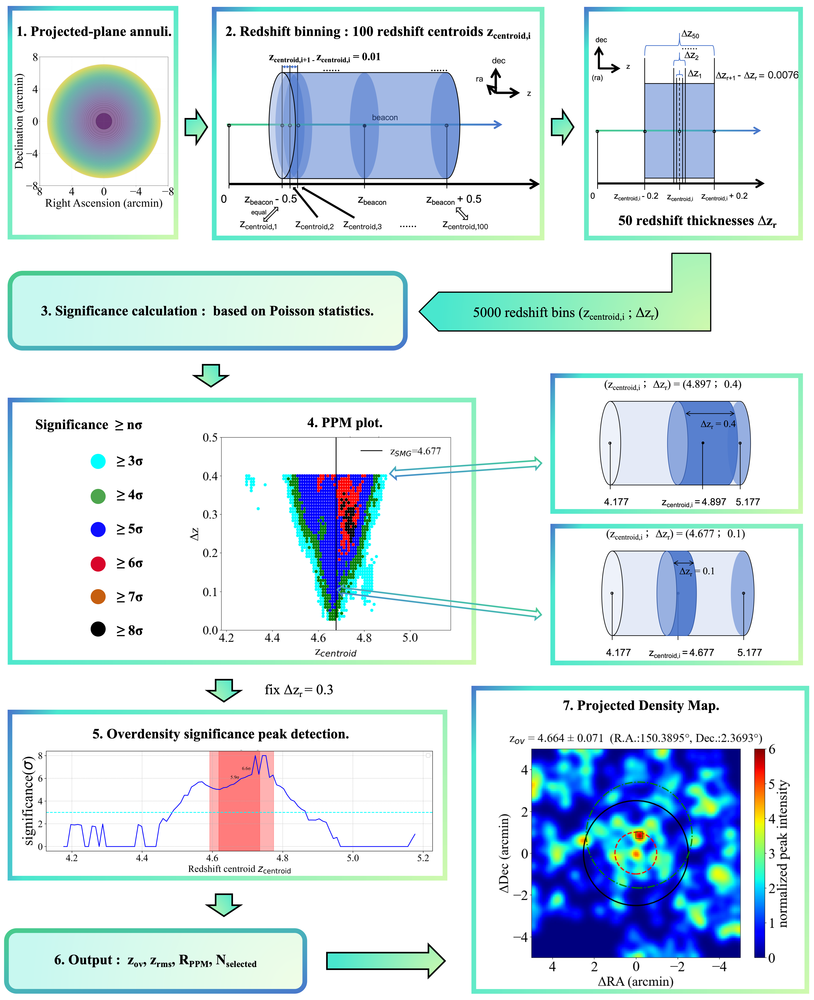

# PPM-analysis-for-COSMOS-Web-field
We use a sample of 449 SMGs from the $A^{3}COSMOS$ catalog and control samples of main-sequence star-forming galaxies (SFGs) from COSMOS2025 in the COSMOS-Web JWST field, we apply the Poisson Probability Method (PPM) to identify overdensity structures.

Detail for $A^{3}COSMOS$:[https://sites.google.com/view/a3cosmos](https://sites.google.com/view/a3cosmos);[http://vizier.cds.unistra.fr/viz-bin/VizieR?-source=J/A+A/685/A1](http://vizier.cds.unistra.fr/viz-bin/VizieR?-source=J/A+A/685/A1)

COSMOS2025:[https://cosmos2025.iap.fr/catalog.html](https://cosmos2025.iap.fr/catalog.html)

---

