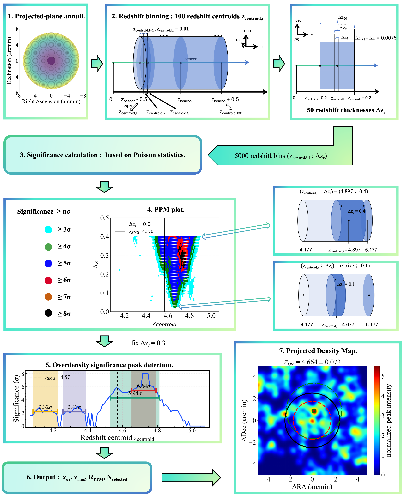

# PPM Results and JWST RGB Cutouts for SMGs and Control SFGs in the COSMOS-Web Field

This repository is the data package for the analysis of galaxy overdensities around submillimeter galaxies (SMGs) and main-sequence star-forming-galaxy (SFG) control sources in the COSMOS-Web field. It contains machine-readable FITS catalogs produced with the Poisson Probability Method (PPM) and JWST RGB cutouts.

！[zenodo](https://doi.org/10.5281/zenodo.22230347)

## Contents

| Path | Contents | How to use it |
| --- | --- | --- |
| `PPM_result/274unique_SMG_assocwith_ovcandidates.fits` | PPM associations for 274 SMGs | Read FITS extension 1 (`Joined`); see the SMG data dictionary below. |
| `PPM_result/3005unique_SFG_assocwith_ovcandidates.fits` | PPM associations for 3,005 main-sequence SFG control sources | Read FITS extension 1 (`Joined`); see the SFG data dictionary below. |
| `JWST_Image/10arcmin/` | 50 RGB cutouts, 10 arcmin on a side | Filenames are `rgb_image_<source ID>.png`. |
| `JWST_Image/10arcsec/` | 50 RGB cutouts, 10 arcsec on a side | The same 50 source IDs, for close inspection. |
| Figure 13 supplementary figure | One annotated JWST RGB image mosaic of the brightest SMGs | See “Supplementary figures” below. |
| Figure 18 supplementary figure | One complete diagnostic-panel figure for COS-SBC4 | See “Supplementary figures” below. |

The two FITS catalogs have 274 and 3,005 rows, respectively. Each image directory contains 50 PNG files, matched one-to-one by source ID.

## Scientific context and scope

We apply the Poisson Probability Method (PPM; [Castignani et al. 2014a](https://iopscience.iop.org/article/10.1088/0004-637X/792/2/113), [2014b](https://ui.adsabs.harvard.edu/abs/2014ApJ...792..114C/abstract)) to a sample of 449 SMGs from A<sup>3</sup>COSMOS and to main-sequence SFG control samples from COSMOS2025 within the COSMOS-Web JWST field. The resulting tables record associations between each beacon source and its identified overdensity candidate.



This deposit distributes **derived PPM products and derived RGB cutouts only**. It does not redistribute the parent A<sup>3</sup>COSMOS, COSMOS2025, or JWST survey catalogs/images. Users needing those inputs must obtain them from their original providers and follow their applicable terms of use:

- [A<sup>3</sup>COSMOS](https://sites.google.com/view/a3cosmos), data version 20220606: [VizieR J/A+A/685/A1](http://vizier.cds.unistra.fr/viz-bin/VizieR?-source=J/A+A/685/A1)
- [COSMOS2025](https://cosmos2025.iap.fr/catalog.html)

For the sample definition, PPM configuration, candidate categories, and scientific interpretation, consult the associated article, *Do Submillimeter Galaxies Trace Megaparsec Large-scale Structures? -- An Overdensity Analysis of 449 Submillimeter Galaxies in COSMOS*.

## Reading the FITS tables

The binary table is in extension 1, named `Joined`. For example:

```python
from astropy.table import Table

smg = Table.read("PPM_result/274unique_SMG_assocwith_ovcandidates.fits", hdu=1)
sfg = Table.read("PPM_result/3005unique_SFG_assocwith_ovcandidates.fits", hdu=1)
print(smg.colnames)
```

Coordinates are ICRS/J2000 and are expressed in degrees unless noted otherwise. Radii and offsets carry their units in the column name. Redshifts are dimensionless. A `Separation` column in both tables is the angular separation between matched catalog objects in arcsec.

### SMG PPM catalog: `274unique_SMG_assocwith_ovcandidates.fits`

| Column | Description |
| --- | --- |
| `ID` | SMG beacon identifier. |
| `zfinal` | Final redshift in the matched SMG catalog; the value `-99` denotes an unavailable value. |
| `RAdeg`, `DEdeg` | SMG beacon right ascension and declination (J2000, deg). |
| `z` | Redshift used for the SMG beacon in the PPM association. |
| `z_ov`, `ez_ov` | Overdensity-peak redshift and its redshift uncertainty. |
| `sig_ov` | Overdensity significance. |
| `Nselected` | Number of selected sources, used as an estimate of the (proto)cluster richness. |
| `R_PPM_arcmin` | PPM projected-radius estimate (arcmin). |
| `R_w_arcmin`, `R_w_kpc` | Radius where the overdensity falls to 1% of its peak value (arcmin and kpc). |
| `peak_ra`, `peak_dec` | Projected overdensity-peak position (J2000, deg). |
| `theta_w_arcmin` | Projected offset between the SMG and overdensity peak (arcmin). |
| `peak_ov_density` | Overdensity value at the projected peak position. |
| `flux_850` | 850-um flux density of the SMG. |
| `Separation` | Angular separation of matched catalog objects (arcsec). |

### SFG-control PPM catalog: `3005unique_SFG_assocwith_ovcandidates.fits`

| Column | Description |
| --- | --- |
| `id` | SFG beacon identifier from COSMOS2025. |
| `ra`, `dec` | SFG beacon right ascension and declination (J2000, deg). |
| `z` | SFG beacon redshift. |
| `peak_ra`, `peak_dec` | Projected overdensity-peak position (J2000, deg). |
| `R_w_arcmin`, `R_w_kpc` | Radius where the overdensity falls to 1% of its peak value (arcmin and kpc). |
| `theta_w_arcmin` | Projected offset between the SFG and overdensity peak (arcmin). |
| `R_PPM_arcmin` | PPM projected-radius estimate (arcmin). |
| `peak_ov_density`, `beacon_ov_density` | Overdensity values at the peak and beacon positions. |
| `candidate_z_mean`, `candidate_z_rms` | Candidate overdensity redshift and redshift uncertainty. |
| `candidate_rmax_median` | Median maximum radius across the candidate peak interval (arcmin). |
| `candidate_richness` | Number of selected sources, used as a richness estimate. |
| `candidate_significance` | Overdensity significance. |
| `delta_z` | Absolute redshift difference between the candidate peak and beacon. |
| `Separation` | Angular separation of matched catalog objects (arcsec). |

## JWST RGB cutouts

The 10-arcmin and 10-arcsec PNG cutouts are both centered on the corresponding overdensity-candidate coordinates. Match an image to its source using the numeric source identifier in `rgb_image_<source ID>.png`. These image products are for visualization and contextual inspection; the FITS catalogs are the machine-readable analysis products. Please note that due to missing data in certain observational bands for SFG IDs 243115 and 352015, their corresponding RGB images are not provided.

## Supplementary figures

Two supplementary figures accompany the manuscript figures:

- **Figure 13 supplementary figure:** one JWST RGB mosaic of all brightest SMGs, shown with 5 arcsec cutouts. Each source is annotated with its identifier, morphology class (Merger or Non-Merger), and environment classification (Category A--E).
- **Figure 18 supplementary figure:** one complete COS-SBC4 diagnostic figure containing the PPM plot and the two-dimensional density-map panels.


## License and citation

The original material in this repository is released under [CC BY 4.0](LICENSE). 

Citation: Deng et al. 2026
